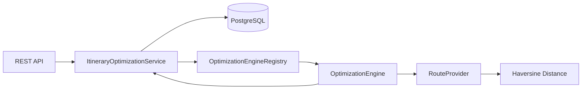
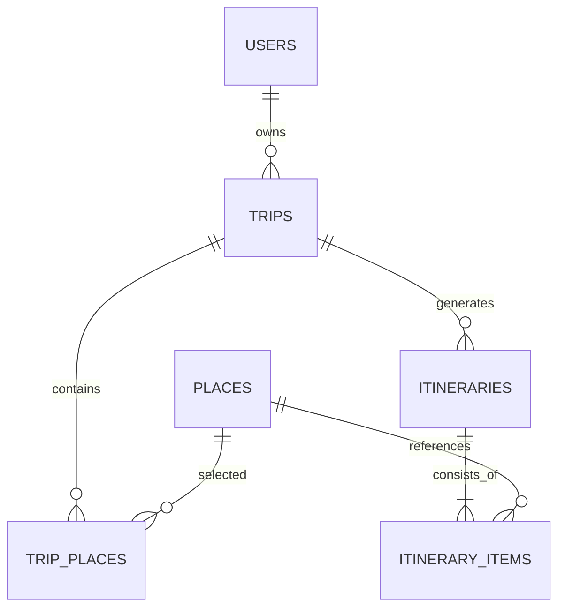

# RoutePlan

RoutePlan은 사용자가 선택한 장소와 여행 조건을 바탕으로 방문 순서를 계산하고, 이후 실제 제약조건과 일정 재최적화, 공유 Route 재사용까지 확장하는 여행 경로 최적화 프로젝트입니다.

V1과 V2는 복잡한 제약조건을 추가하기 전에 다음 질문부터 검증합니다.

> 숙소와 방문 장소의 좌표가 주어졌을 때, 재현 가능한 방문 순서를 계산하고 휴리스틱 결과가 최적해와 얼마나 다른지 측정할 수 있는가?

## 구현 범위 (V1–V2)

### 지원

- 최소 사용자 생성
- 하루짜리 Trip 생성·조회·수정
- 좌표 기반 Place 등록·조회
- Trip에 장소 추가·삭제
- Haversine 직선거리 계산
- 이동수단별 고정 평균속도를 이용한 예상 이동시간
- Nearest Neighbor 방문 순서 계산
- Exact Search 기반 최적해 계산
- Nearest Neighbor 결과를 개선하는 2-opt
- 알고리즘별 일정 생성과 Itinerary version 저장
- 고정 seed 기반 재현 가능한 Algorithm Benchmark
- 매 최적화 결과를 새로운 Itinerary 버전으로 저장
- 최신 또는 특정 Itinerary 조회
- PostgreSQL, Flyway, OpenAPI, Docker Compose
- JUnit 5, AssertJ, Testcontainers 테스트

### 지원하지 않음

- 실제 도로·대중교통 경로 및 실제 이동시간
- 여러 날짜에 장소 배분
- 마지막 장소에서 숙소로 돌아오는 경로
- 영업시간, 체류시간, Must Visit, Priority, 하루 종료시간
- 영속 Route Matrix와 외부 경로 캐시
- 외부 Places/Route API
- Redis, QueryDSL, PostGIS
- 인증, 공유 Route, 커뮤니티, LLM

API의 `estimatedTravelMinutes`는 실제 지도 이동시간이 아니라 직선거리와 고정 평균속도로 계산한 추정치입니다.

## 기술 스택

- Java 21
- Spring Boot 4.1.0
- Spring Web MVC
- Spring Data JPA
- PostgreSQL 16
- Flyway
- Gradle Wrapper
- JUnit 5, AssertJ, Testcontainers
- springdoc-openapi
- Docker, Docker Compose

QueryDSL은 동적 검색 쿼리가 없는 현재 단계에서는 사용하지 않습니다. Redis와 PostGIS도 해결해야 할 실제 문제가 확인된 이후 도입합니다.

## Architecture

기능 중심 모듈러 모놀리스 구조를 사용합니다.

```text
com.routeplan
├─ common          공통 오류 응답
├─ user            최소 사용자
├─ trip            Trip과 TripPlace
├─ place           장소 정보
├─ optimization    Spring/JPA와 분리된 경로 계산
└─ itinerary       최적화 orchestration과 결과 저장
```



`OptimizationEngine`은 JPA Entity를 받지 않습니다. 애플리케이션 서비스가 Entity를 순수 입력 모델로 변환하고 알고리즘 결과를 다시 Itinerary로 저장합니다.

## Domain Model



주요 DB 제약조건은 다음과 같습니다.

- 같은 Trip에 같은 Place를 두 번 추가할 수 없음
- 같은 Trip에 같은 Itinerary version을 저장할 수 없음
- 같은 Itinerary에 같은 sequence를 저장할 수 없음
- 위도와 경도의 지구 좌표 범위 검증
- V1 Trip은 `start_date = end_date`

## Optimization Engine

현재 엔진은 숙소에서 출발하는 열린 경로를 계산합니다. 마지막 장소에서 숙소로 돌아오는 비용은 포함하지 않습니다. 목적함수는 `예상 이동시간 → 이동거리 → TripPlace ID 순서`의 사전식 비교를 사용합니다.

```java
public interface OptimizationEngine {
    OptimizationAlgorithm algorithm();
    OptimizationResult optimize(OptimizationRequest request);
}
```

```java
public interface RouteProvider {
    RouteResult getRoute(Location origin, Location destination, TransportMode mode);
}
```

### Nearest Neighbor

1. 현재 위치를 숙소로 설정합니다.
2. 모든 미방문 장소까지 이동비용을 계산합니다.
3. 예상 이동시간이 가장 작은 장소를 선택합니다.
4. 이동시간이 같으면 거리, 거리도 같으면 `TripPlace.id`로 순서를 결정합니다.
5. 모든 장소를 방문할 때까지 반복합니다.

장소가 `N`개일 때 RouteProvider 호출 수는 최대 `N(N+1)/2`, 시간복잡도는 `O(N²)`입니다. Trip당 장소 수는 50개로 제한합니다.

Nearest Neighbor는 전체 최적해를 보장하지 않습니다. 이 결과를 Exact Search와 비교하고 2-opt의 초기 경로로 사용합니다.

### Exact Search

가능한 모든 방문 순서를 DFS로 탐색합니다. 누적 이동비용이 이미 발견된 최선의 전체 경로보다 큰 분기는 더 탐색하지 않습니다.

```text
5곳  = 120개 순열
8곳  = 40,320개 순열
10곳 = 3,628,800개 순열
```

최적해를 보장하지만 최악의 시간복잡도는 `O(N!)`입니다. API에서는 장소가 10개를 초과하면 계산을 시작하기 전에 `422 EXACT_SEARCH_LIMIT_EXCEEDED`를 반환합니다.

### Nearest Neighbor + 2-opt

Nearest Neighbor 경로에서 구간 `[i, k]`를 뒤집은 모든 후보를 비교하고, 가장 좋은 후보로 교체하는 과정을 더 이상 개선되지 않을 때까지 반복합니다. 대칭 거리를 가정한 delta 공식 대신 전체 경로를 재평가하므로 향후 방향별 이동시간이 다른 RouteProvider에서도 정확하게 비교할 수 있습니다.

하나의 최적화 요청 안에서는 동일 구간의 RouteProvider 결과를 메모이즈합니다. 이는 요청 범위를 벗어나지 않으며 Redis나 영속 Route Matrix가 아닙니다. 2-opt는 국소 최적화이므로 Exact와 같은 결과를 보장하지 않습니다.

## API

| Method | Endpoint | 기능 |
|---|---|---|
| `POST` | `/api/v1/users` | 사용자 생성 |
| `POST` | `/api/v1/trips` | 하루 Trip 생성 |
| `GET` | `/api/v1/trips/{tripId}` | Trip과 장소 조회 |
| `PATCH` | `/api/v1/trips/{tripId}` | Trip 수정 |
| `POST` | `/api/v1/places` | Place 등록 |
| `GET` | `/api/v1/places/{placeId}` | Place 조회 |
| `POST` | `/api/v1/trips/{tripId}/places` | Trip에 Place 추가 |
| `DELETE` | `/api/v1/trips/{tripId}/places/{placeId}` | Trip에서 Place 제거 |
| `POST` | `/api/v1/trips/{tripId}/optimize?algorithm=...` | 선택한 알고리즘으로 일정 생성 및 새 버전 저장 |
| `GET` | `/api/v1/trips/{tripId}/itineraries/latest` | 최신 일정 조회 |
| `GET` | `/api/v1/itineraries/{itineraryId}` | 특정 일정 조회 |

애플리케이션 실행 후 Swagger UI는 `http://localhost:8080/swagger-ui.html`에서 확인할 수 있습니다.

지원 알고리즘은 다음과 같습니다. 쿼리 파라미터를 생략하면 기존과 동일하게 `NEAREST_NEIGHBOR`를 사용합니다.

```text
NEAREST_NEIGHBOR
EXACT_SEARCH
NEAREST_NEIGHBOR_2_OPT
```

## Local Run

### Docker Compose

```bash
docker compose up --build
```

Backend는 `http://localhost:8080`, PostgreSQL은 `localhost:5432`에서 실행됩니다.
이미 사용 중인 포트가 있다면 `.env`의 `BACKEND_PORT` 또는 `POSTGRES_PORT`를 변경할 수 있습니다.

### 애플리케이션 직접 실행

PostgreSQL만 실행합니다.

```bash
docker compose up -d postgres
```

그다음 Gradle Wrapper를 실행합니다.

```bash
# Windows
gradlew.bat bootRun

# macOS/Linux
./gradlew bootRun
```

기본 로컬 DB 설정은 다음과 같습니다.

```text
database: routeplan
username: routeplan
password: routeplan-local
```

실제 비밀번호는 `.env`에서 변경하고 `.env`를 Git에 포함하지 않습니다.

## Test

```bash
# Windows
gradlew.bat test

# macOS/Linux
./gradlew test
```

Benchmark는 일반 테스트와 분리해서 실행합니다.

```bash
# Windows
gradlew.bat algorithmBenchmark

# macOS/Linux
./gradlew algorithmBenchmark
```

테스트는 다음을 검증합니다.

- 좌표 범위
- Haversine 거리와 대칭성
- 이동수단별 예상시간
- Nearest Neighbor 순서와 비용 합계
- 동일 비용의 결정적 순서
- Exact Search의 전역 최적해와 10곳 제한
- 2-opt의 경로 개선과 단일 장소 경계값
- 하루 여행 불변식
- Flyway 및 PostgreSQL JPA 매핑
- 사용자 → 여행 → 장소 → 최적화 전체 API 흐름
- 반복 최적화 시 version 증가
- 알고리즘별 결과와 version 증가
- 중복 장소, 빈 여행, 다일 여행 오류 응답

통합 테스트는 H2 대신 PostgreSQL Testcontainers를 사용하므로 Docker가 실행 중이어야 합니다.

## Transaction

현재 RouteProvider는 네트워크 요청 없이 CPU 계산만 수행합니다. 최적화 중 Trip을 비관적 Lock으로 조회하고, 최신 version을 확인한 뒤 결과를 하나의 트랜잭션으로 저장합니다. `(trip_id, version)` unique constraint도 동시성의 마지막 방어선으로 사용합니다.

실제 Route API를 연동하는 단계에서는 외부 요청 중 DB Lock을 유지하지 않도록 다음 구조로 변경해야 합니다.

```text
입력 Snapshot 조회 → 외부 Route 계산 → 짧은 결과 저장 트랜잭션
```

## Algorithm Roadmap

```text
V1  Nearest Neighbor ✓
 ↓
V2  Exact Search로 품질 측정 ✓
 ↓
V2  Nearest Neighbor + 2-opt ✓
 ↓
V3  영업시간·체류시간·Must Visit·Priority
 ↓
V4  실제 Place/Route API와 Route Matrix
```

## Performance Benchmark

측정 환경은 Windows 11, Java 21.0.12.1, Intel Core i5-12500 6코어/12스레드, 메모리 15.8GB입니다. 오사카 주변에 고정 seed `20260825`로 생성한 좌표를 사용했습니다. 각 알고리즘을 1회 예열한 뒤 Exact는 3~5회, Nearest Neighbor는 15회, 2-opt는 10회 실행한 중앙값입니다.

이 측정은 애플리케이션 수준의 경량 Benchmark이며 JMH 결과가 아닙니다. 실행시간은 머신과 JVM 상태에 따라 달라질 수 있습니다. 원시 결과는 [`docs/benchmarks/v2-algorithm-benchmark.csv`](docs/benchmarks/v2-algorithm-benchmark.csv)에 보존합니다.

| 장소 | Algorithm | 중앙시간(ms) | 예상 이동시간(분) | 거리(m) | Exact 거리 오차 |
|---:|---|---:|---:|---:|---:|
| 5 | Exact Search | 0.417 | 1,045 | 78,152 | 0.00% |
| 5 | Nearest Neighbor | 0.076 | 1,114 | 83,317 | 6.61% |
| 5 | Nearest + 2-opt | 0.215 | 1,045 | 78,152 | 0.00% |
| 8 | Exact Search | 0.826 | 1,070 | 79,938 | 0.00% |
| 8 | Nearest Neighbor | 0.042 | 1,200 | 89,637 | 12.13% |
| 8 | Nearest + 2-opt | 0.298 | 1,070 | 79,938 | 0.00% |
| 10 | Exact Search | 7.925 | 1,109 | 82,768 | 0.00% |
| 10 | Nearest Neighbor | 0.037 | 1,233 | 92,093 | 11.27% |
| 10 | Nearest + 2-opt | 0.383 | 1,109 | 82,768 | 0.00% |
| 15 | Nearest Neighbor | 0.050 | 1,648 | 123,121 | - |
| 15 | Nearest + 2-opt | 0.386 | 1,544 | 115,352 | - |
| 20 | Nearest Neighbor | 0.073 | 2,388 | 178,376 | - |
| 20 | Nearest + 2-opt | 1.342 | 2,188 | 163,377 | - |
| 30 | Nearest Neighbor | 0.141 | 2,843 | 212,166 | - |
| 30 | Nearest + 2-opt | 2.443 | 2,544 | 189,760 | - |
| 50 | Nearest Neighbor | 0.165 | 4,107 | 305,993 | - |
| 50 | Nearest + 2-opt | 14.980 | 3,481 | 259,165 | - |

이 데이터에서는 2-opt가 5·8·10곳에서 Exact와 같은 결과를 찾았지만 일반적인 최적해 보장은 아닙니다. 50곳에서는 Nearest Neighbor보다 거리를 약 15.3% 줄였고 중앙 실행시간은 약 90배 증가했습니다. 절대 실행시간은 여전히 15ms 미만이지만 실제 Route API가 연결되면 요청 범위 메모이즈와 Matrix 생성 비용을 별도로 측정해야 합니다.

10곳 Exact Search가 7.925ms에 끝난 것은 이 입력에서 누적비용 기반 분기 중단이 효과적이었기 때문입니다. `O(N!)` 최악 복잡도가 사라진 것은 아니므로 10곳 제한을 유지합니다.

## Known Limitations

- 직선거리는 강, 철도, 도로망과 환승을 반영하지 않습니다.
- 고정 평균속도는 실제 교통상황을 반영하지 않습니다.
- Nearest Neighbor가 만든 경로는 최적해가 아닐 수 있습니다.
- 2-opt는 국소 최적해이며 Exact와 같은 결과를 보장하지 않습니다.
- Exact Search는 조합 폭증 때문에 10곳까지만 허용합니다.
- 모든 장소를 방문하므로 시간이 부족한 상황을 처리하지 못합니다.
- 방문 시각과 영업시간을 계산하지 않습니다.
- 인증이 없어 `userId`는 소유 관계만 표현하며 권한을 보장하지 않습니다.
