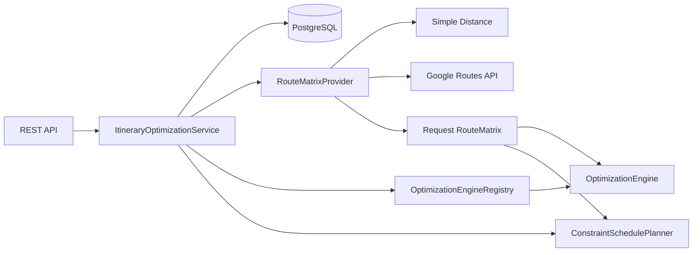
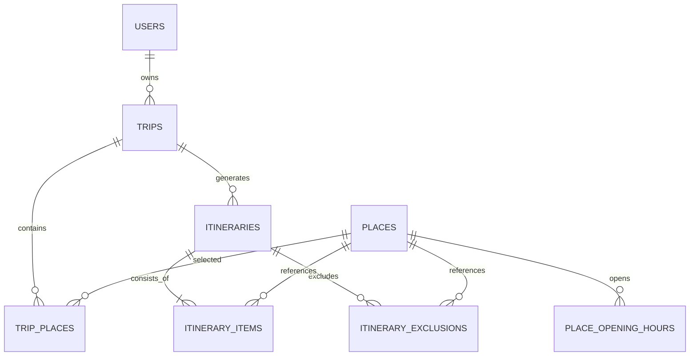

# RoutePlan

RoutePlan은 사용자가 선택한 장소와 여행 조건을 바탕으로 방문 순서를 계산하고, 이후 실제 제약조건과 일정 재최적화, 공유 Route 재사용까지 확장하는 여행 경로 최적화 프로젝트입니다.

V1과 V2는 복잡한 제약조건을 추가하기 전에 다음 질문부터 검증했습니다.

> 숙소와 방문 장소의 좌표가 주어졌을 때, 재현 가능한 방문 순서를 계산하고 휴리스틱 결과가 최적해와 얼마나 다른지 측정할 수 있는가?

V3는 그 경로를 실제 하루 일정으로 바꾸기 위해 다음 질문을 다뤘습니다.

> 영업시간과 체류시간을 지키고, 중요한 장소를 우선하면서 하루 종료 전 숙소로 돌아오는 실행 가능한 일정을 만들 수 있는가?

V4는 추정 좌표 데이터를 실제 외부 데이터로 교체할 수 있는 경계를 추가합니다.

> 장소 검색 결과의 고유 ID와 실제 도로·대중교통 이동시간을 사용하면서 외부 API 호출을 Matrix 단위로 통제할 수 있는가?

## 구현 범위 (V1–V4)

### 지원

- 최소 사용자 생성
- 하루짜리 Trip 생성·조회·수정
- 좌표 기반 Place 등록·조회
- Trip에 장소 추가·삭제
- Haversine 직선거리 계산
- 이동수단별 고정 평균속도를 이용한 예상 이동시간
- Nearest Neighbor 방문 순서 계산
- Exact Search 기반 최적해 계산
- Nearest Neighbor 결과를 개선하는 2-opt
- 알고리즘별 일정 생성과 Itinerary version 저장
- 고정 seed 기반 재현 가능한 Algorithm Benchmark
- 요일별 영업시간과 휴무일
- 장소별 평균 체류시간과 여행별 최소·최대 체류시간
- Must Visit과 1–100 Priority
- 선호 방문 시간창
- 하루 시작·종료시간과 숙소 복귀
- `ACTIVE`, `STANDARD`, `RELAXED` 여행 강도
- 도착·대기·방문 시작·종료 시각 계산
- 선택 장소 제외 사유와 Must Visit 충돌 상세 응답
- Google Places API (New) Text Search Adapter
- Google 검색 장소의 `externalPlaceId` 기반 멱등 가져오기
- Google Routes API Compute Route Matrix Adapter
- 이동수단별 Route Matrix 요청 분할
- 경로 엔진과 제약 일정 계산기가 공유하는 요청 단위 Matrix
- 일정별 Route 데이터 출처·Provider 호출 수·Matrix 요소 수·생성시간 저장
- 외부 요청과 DB Lock을 분리한 Snapshot 검증 트랜잭션
- 매 최적화 결과를 새로운 Itinerary 버전으로 저장
- 최신 또는 특정 Itinerary 조회
- PostgreSQL, Flyway, OpenAPI, Docker Compose
- JUnit 5, AssertJ, Testcontainers 테스트

### 지원하지 않음

- 실제 도로·대중교통 경로 및 실제 이동시간
- 여러 날짜에 장소 배분
- 영속 Route Matrix와 외부 경로 캐시
- Google Places 영업시간 자동 가져오기
- Redis, QueryDSL, PostGIS
- 인증, 공유 Route, 커뮤니티, LLM

기본 `SIMPLE` 모드의 `estimatedTravelMinutes`는 직선거리와 고정 평균속도로 계산한 추정치입니다. `GOOGLE` Route Provider를 활성화하면 Google Routes API가 반환한 실제 경로 거리와 이동시간을 사용합니다.

## 기술 스택

- Java 21
- Spring Boot 4.1.0
- Spring Web MVC
- Spring Data JPA
- PostgreSQL 16
- Flyway
- Gradle Wrapper
- JUnit 5, AssertJ, Testcontainers
- springdoc-openapi
- Docker, Docker Compose

QueryDSL은 동적 검색 쿼리가 없는 현재 단계에서는 사용하지 않습니다. Redis와 PostGIS도 해결해야 할 실제 문제가 확인된 이후 도입합니다.

## Architecture

기능 중심 모듈러 모놀리스 구조를 사용합니다.

```text
com.routeplan
├─ common          공통 오류 응답
├─ user            최소 사용자
├─ trip            Trip과 TripPlace
├─ place           장소 정보
├─ optimization    Spring/JPA와 분리된 경로·제약 일정 계산
└─ itinerary       최적화 orchestration과 결과 저장
```



`OptimizationEngine`과 `ConstraintSchedulePlanner`는 JPA Entity를 받지 않습니다. 애플리케이션 서비스가 Entity를 순수 입력 Snapshot으로 변환하고, Route Matrix를 한 번 만든 뒤 두 계산 계층에 같은 Matrix를 전달합니다. 경로 순서 탐색과 현실 제약 일정 계산을 분리해 V2 알고리즘 비교 기준도 유지했습니다.

## Domain Model



주요 DB 제약조건은 다음과 같습니다.

- 같은 Trip에 같은 Place를 두 번 추가할 수 없음
- 같은 Trip에 같은 Itinerary version을 저장할 수 없음
- 같은 Itinerary에 같은 sequence를 저장할 수 없음
- 위도와 경도의 지구 좌표 범위 검증
- 장소·요일별 영업시간 한 건만 허용
- 영업일의 종료시간은 시작시간보다 늦어야 함
- Priority는 1–100, 체류시간은 1–1,440분
- Trip의 하루 종료시간은 시작시간보다 늦어야 함
- V1 Trip은 `start_date = end_date`

## Optimization Engine

V2 경로 엔진은 숙소에서 출발하는 열린 경로 후보를 계산합니다. 목적함수는 `예상 이동시간 → 이동거리 → TripPlace ID 순서`의 사전식 비교를 사용합니다. V3 제약 일정 계산기는 이 후보를 입력으로 받아 방문 가능성을 검증하고 마지막 장소에서 숙소로 돌아오는 구간까지 최종 합계에 포함합니다.

```java
public interface OptimizationEngine {
    OptimizationAlgorithm algorithm();
    OptimizationResult optimize(OptimizationRequest request);
}
```

```java
public interface RouteProvider {
    RouteResult getRoute(Location origin, Location destination, TransportMode mode);
}
```

### Nearest Neighbor

1. 현재 위치를 숙소로 설정합니다.
2. 모든 미방문 장소까지 이동비용을 계산합니다.
3. 예상 이동시간이 가장 작은 장소를 선택합니다.
4. 이동시간이 같으면 거리, 거리도 같으면 `TripPlace.id`로 순서를 결정합니다.
5. 모든 장소를 방문할 때까지 반복합니다.

장소가 `N`개일 때 RouteProvider 호출 수는 최대 `N(N+1)/2`, 시간복잡도는 `O(N²)`입니다. Trip당 장소 수는 50개로 제한합니다.

Nearest Neighbor는 전체 최적해를 보장하지 않습니다. 이 결과를 Exact Search와 비교하고 2-opt의 초기 경로로 사용합니다.

### Exact Search

가능한 모든 방문 순서를 DFS로 탐색합니다. 누적 이동비용이 이미 발견된 최선의 전체 경로보다 큰 분기는 더 탐색하지 않습니다.

```text
5곳  = 120개 순열
8곳  = 40,320개 순열
10곳 = 3,628,800개 순열
```

최적해를 보장하지만 최악의 시간복잡도는 `O(N!)`입니다. API에서는 장소가 10개를 초과하면 계산을 시작하기 전에 `422 EXACT_SEARCH_LIMIT_EXCEEDED`를 반환합니다.

### Nearest Neighbor + 2-opt

Nearest Neighbor 경로에서 구간 `[i, k]`를 뒤집은 모든 후보를 비교하고, 가장 좋은 후보로 교체하는 과정을 더 이상 개선되지 않을 때까지 반복합니다. 대칭 거리를 가정한 delta 공식 대신 전체 경로를 재평가하므로 향후 방향별 이동시간이 다른 RouteProvider에서도 정확하게 비교할 수 있습니다.

V4부터 숙소와 모든 후보 장소의 방향별 Route Matrix를 최적화 전에 한 번 생성합니다. 경로 엔진과 제약 일정 계산기가 같은 Matrix를 조회하므로 단계 사이의 중복 외부 호출이 없습니다. Matrix는 요청이 끝나면 폐기되며 Redis나 영속 Cache는 아닙니다. 2-opt는 국소 최적화이므로 Exact와 같은 결과를 보장하지 않습니다.

## Constraint 처리

### Time Window와 체류시간

장소의 요일별 영업시간, TripPlace의 선호시간, Trip의 하루 시작·종료시간의 교집합을 실제 방문 가능 시간창으로 사용합니다. 도착이 시작 가능시간보다 빠르면 기다리고, `방문 종료시각 <= 시간창 종료시각`을 만족할 때만 장소를 포함합니다.

영업시간 정보가 없는 장소는 하루 운영시간 전체에 방문할 수 있는 것으로 취급합니다. 명시적으로 `closed=true`인 날은 방문할 수 없습니다. Google 검색 결과 가져오기는 아직 영업시간을 자동 저장하지 않으므로 V3 영업시간 API로 별도 설정해야 합니다. 한 장소에 요일별 영업 구간 하나만 지원하며 자정을 넘는 영업시간은 지원하지 않습니다.

여행 강도는 체류시간을 다음처럼 결정합니다.

| Pace | 체류시간 |
|---|---|
| `ACTIVE` | 설정된 최소시간, 미설정 시 평균의 75% |
| `STANDARD` | 평균시간을 최소·최대 범위 안으로 보정 |
| `RELAXED` | 설정된 최대시간, 미설정 시 평균의 125% |

기본 최소 체류시간은 15분보다 짧아지지 않습니다.

### Must Visit, Priority와 숙소 복귀

1. Must Visit 후보를 먼저 일정에 삽입합니다.
2. 나머지 후보는 Priority 내림차순으로 처리합니다.
3. 현재 경로의 모든 삽입 위치를 평가하고 실행 가능한 위치 중 Score가 가장 높은 위치를 선택합니다.
4. 선택 장소를 넣을 수 없으면 `CLOSED`, `TIME_WINDOW`, `DAILY_LIMIT` 사유와 함께 제외 내역을 저장합니다.
5. Must Visit을 넣을 수 없으면 10곳 이하에서 순열 복구를 시도한 뒤, 실패 시 `422 INFEASIBLE_MUST_VISIT`와 장소별 충돌 원인을 반환합니다.
6. 마지막 방문 후 숙소 복귀시각이 하루 종료시각을 넘는 일정은 허용하지 않습니다.

현재 일정 Score는 테스트 가능한 정수식으로 계산합니다.

```text
score = 방문 Priority 합 × 10,000
        - 총 이동시간 × 5
        - 총 대기시간 × 2
```

Priority가 핵심 선택 기준이고, 같은 방문 집합에서는 이동·대기 비용이 작은 경로를 선택합니다. 모든 값과 제외 내역은 Itinerary 버전에 Snapshot으로 저장됩니다.

`EXACT_SEARCH`는 제약이 없는 V2 이동 경로에서는 전역 최적해를 보장합니다. 시간창 때문에 장소가 제외되거나 재배치되면 현재 V3의 우선순위 삽입 휴리스틱이 최종 결정을 내리므로 전체 제약 최적화 문제의 전역 최적해까지 보장하지는 않습니다.

## 외부 지도 API와 Route Matrix

### Google Places Text Search

장소 검색은 [Google Places API (New) Text Search](https://developers.google.com/maps/documentation/places/web-service/text-search)의 `POST /v1/places:searchText` 계약을 사용합니다. 비용과 응답 크기를 제한하기 위해 다음 필드만 요청합니다.

```text
places.id
places.displayName
places.formattedAddress
places.location
places.primaryType
```

검색 결과는 바로 DB에 저장하지 않습니다. 사용자가 선택한 결과만 `/api/v1/places/import`로 가져오며, Google Place ID를 `externalPlaceId` unique key로 사용해 같은 장소의 반복 가져오기를 멱등 처리합니다. 검색 중심 좌표와 1–50,000m 반경을 선택적으로 전달할 수 있고 결과는 요청당 최대 20개로 제한합니다.

### Google Routes Compute Route Matrix

[Google Routes API Compute Route Matrix](https://developers.google.com/maps/documentation/routes/compute_route_matrix)의 `POST /distanceMatrix/v2:computeRouteMatrix`를 사용합니다. 응답 순서를 신뢰하지 않고 각 element의 `originIndex`, `destinationIndex`, `status`, `condition`, `distanceMeters`, `duration`을 검증합니다.

Google 제한에 맞춰 Matrix를 다음 크기로 분할합니다.

| 이동수단 | Google travelMode | 요청당 Chunk | 최대 요소 |
|---|---|---:|---:|
| `WALKING` | `WALK` | 25 × 25 | 625 |
| `DRIVING` | `DRIVE` | 25 × 25 | 625 |
| `PUBLIC_TRANSIT` | `TRANSIT` | 10 × 10 | 100 |

Trip 장소 수에 따른 전체 Matrix와 계획된 외부 요청 수는 다음과 같습니다. 위치 수에는 숙소 한 곳이 포함됩니다.

| 장소 | 위치 | Matrix 요소 | WALK/DRIVE 요청 | TRANSIT 요청 |
|---:|---:|---:|---:|---:|
| 5 | 6 | 36 | 1 | 1 |
| 8 | 9 | 81 | 1 | 1 |
| 10 | 11 | 121 | 1 | 4 |
| 15 | 16 | 256 | 1 | 4 |
| 20 | 21 | 441 | 1 | 9 |
| 30 | 31 | 961 | 4 | 16 |
| 50 | 51 | 2,601 | 9 | 36 |

분할 개수와 100요소 제한은 로컬 HTTP Stub 계약 테스트로 검증했습니다. 실제 Google API 키가 이 개발 환경에 없어 과금이 발생하는 실호출 latency는 기록하지 않았습니다. 대신 모든 Itinerary에 다음 값을 저장해 실제 환경의 측정값이 자동으로 남도록 했습니다.

```text
routeDataType
routeProviderCallCount
routeMatrixElementCount
routeMatrixBuildMillis
```

`SIMPLE`은 외부 호출 수가 0이고, `GOOGLE`은 실제 HTTP 요청 수와 전체 Matrix 생성시간을 기록합니다.

## API

| Method | Endpoint | 기능 |
|---|---|---|
| `POST` | `/api/v1/users` | 사용자 생성 |
| `POST` | `/api/v1/trips` | 하루 Trip 생성 |
| `GET` | `/api/v1/trips/{tripId}` | Trip과 장소 조회 |
| `PATCH` | `/api/v1/trips/{tripId}` | Trip 수정 |
| `POST` | `/api/v1/places` | Place 등록 |
| `GET` | `/api/v1/places/{placeId}` | Place 조회 |
| `GET` | `/api/v1/places/search?query=...` | 외부 장소 텍스트 검색 |
| `POST` | `/api/v1/places/import` | 선택한 외부 장소를 Place로 멱등 가져오기 |
| `PUT` | `/api/v1/places/{placeId}/opening-hours/{dayOfWeek}` | 요일별 영업시간·휴무 설정 |
| `GET` | `/api/v1/places/{placeId}/opening-hours` | 장소 영업시간 조회 |
| `POST` | `/api/v1/trips/{tripId}/places` | Trip에 Place 추가 |
| `PATCH` | `/api/v1/trips/{tripId}/places/{placeId}` | Must Visit·Priority·시간·체류 제약 교체 |
| `DELETE` | `/api/v1/trips/{tripId}/places/{placeId}` | Trip에서 Place 제거 |
| `POST` | `/api/v1/trips/{tripId}/optimize?algorithm=...` | 선택한 알고리즘으로 일정 생성 및 새 버전 저장 |
| `GET` | `/api/v1/trips/{tripId}/itineraries/latest` | 최신 일정 조회 |
| `GET` | `/api/v1/itineraries/{itineraryId}` | 특정 일정 조회 |

애플리케이션 실행 후 Swagger UI는 `http://localhost:8080/swagger-ui.html`에서 확인할 수 있습니다.

지원 알고리즘은 다음과 같습니다. 쿼리 파라미터를 생략하면 기존과 동일하게 `NEAREST_NEIGHBOR`를 사용합니다.

```text
NEAREST_NEIGHBOR
EXACT_SEARCH
NEAREST_NEIGHBOR_2_OPT
```

Trip 생성 시 `dailyStartTime`, `dailyEndTime`, `pace`를 생략하면 각각 `09:00`, `20:00`, `STANDARD`를 사용합니다. Place의 `averageStayMinutes` 기본값은 60분이고, TripPlace의 Priority 기본값은 50입니다.

```json
{
  "placeId": 1,
  "priority": 100,
  "mustVisit": true,
  "preferredStartTime": "10:00",
  "preferredEndTime": "12:00",
  "minimumStayMinutes": 60,
  "maximumStayMinutes": 90
}
```

### 외부 Provider 설정

기본값은 API 키 없이 실행 가능한 다음 조합입니다.

```text
ROUTEPLAN_PLACE_PROVIDER=DISABLED
ROUTEPLAN_ROUTE_PROVIDER=SIMPLE
```

Google Cloud 프로젝트에서 Places API (New)와 Routes API를 활성화하고 제한된 API 키를 발급한 뒤 `.env`를 다음처럼 설정하면 실제 Provider를 사용합니다.

```dotenv
ROUTEPLAN_PLACE_PROVIDER=GOOGLE
ROUTEPLAN_ROUTE_PROVIDER=GOOGLE
GOOGLE_MAPS_API_KEY=your-restricted-key
```

API 키는 요청 헤더에만 사용하며 오류 메시지나 응답에 포함하지 않습니다. 키가 없거나 장소 검색 Provider가 비활성화된 경우 검색은 `503 EXTERNAL_PROVIDER_NOT_CONFIGURED`를 반환합니다. Google의 429는 `EXTERNAL_PROVIDER_RATE_LIMITED`, 연결·5xx는 `EXTERNAL_PROVIDER_UNAVAILABLE`, 잘못된 element는 `EXTERNAL_PROVIDER_INVALID_RESPONSE`로 구분합니다. V4에서는 자동 Retry를 적용하지 않습니다.

## Local Run

### Docker Compose

```bash
docker compose up --build
```

Backend는 `http://localhost:8080`, PostgreSQL은 `localhost:5432`에서 실행됩니다.
이미 사용 중인 포트가 있다면 `.env`의 `BACKEND_PORT` 또는 `POSTGRES_PORT`를 변경할 수 있습니다.

### 애플리케이션 직접 실행

PostgreSQL만 실행합니다.

```bash
docker compose up -d postgres
```

그다음 Gradle Wrapper를 실행합니다.

```bash
# Windows
gradlew.bat bootRun

# macOS/Linux
./gradlew bootRun
```

기본 로컬 DB 설정은 다음과 같습니다.

```text
database: routeplan
username: routeplan
password: routeplan-local
```

실제 비밀번호는 `.env`에서 변경하고 `.env`를 Git에 포함하지 않습니다.

## Test

```bash
# Windows
gradlew.bat test

# macOS/Linux
./gradlew test
```

Benchmark는 일반 테스트와 분리해서 실행합니다.

```bash
# Windows
gradlew.bat algorithmBenchmark

# macOS/Linux
./gradlew algorithmBenchmark
```

테스트는 다음을 검증합니다.

- 좌표 범위
- Haversine 거리와 대칭성
- 이동수단별 예상시간
- Nearest Neighbor 순서와 비용 합계
- 동일 비용의 결정적 순서
- Exact Search의 전역 최적해와 10곳 제한
- 2-opt의 경로 개선과 단일 장소 경계값
- 하루 여행 불변식
- Flyway 및 PostgreSQL JPA 매핑
- 사용자 → 여행 → 장소 → 최적화 전체 API 흐름
- 반복 최적화 시 version 증가
- 알고리즘별 결과와 version 증가
- 영업 시작 전 대기와 방문 시작·종료 시각
- 하루 종료 전 숙소 복귀
- 여행 강도별 체류시간
- 높은 Priority 장소 보존과 낮은 Priority 장소 제외
- 휴무일 Must Visit의 구조화된 422 충돌 응답
- Google Places 요청 body·API key·Field Mask 계약
- Google Routes Matrix element index·duration 파싱
- 대중교통 Matrix 100요소 요청 분할
- 외부 429 오류 매핑과 API key 비노출
- 외부 Place ID의 멱등 가져오기
- 일정별 Matrix 요소 수·Provider 호출 수 저장
- 중복 장소, 빈 여행, 다일 여행 오류 응답

통합 테스트는 H2 대신 PostgreSQL Testcontainers를 사용하므로 Docker가 실행 중이어야 합니다.

## Transaction

V4에서는 외부 Route API를 호출하는 동안 DB 트랜잭션이나 비관적 Lock을 유지하지 않습니다.

```text
짧은 읽기 Transaction
→ 입력 Snapshot
→ Transaction 밖에서 Route Matrix·최적화
→ Trip 비관적 Lock
→ 현재 입력과 Snapshot 재비교
→ 짧은 결과 저장 Transaction
```

저장 직전에 Trip, TripPlace, Place 좌표·체류시간, 당일 영업시간을 다시 순수 입력 모델로 만들고 원래 Snapshot과 비교합니다. 달라졌다면 오래된 결과를 저장하지 않고 `409 OPTIMIZATION_INPUT_CHANGED`를 반환합니다. `(trip_id, version)` unique constraint도 동시성의 마지막 방어선으로 유지합니다.

## Algorithm Roadmap

```text
V1  Nearest Neighbor ✓
 ↓
V2  Exact Search로 품질 측정 ✓
 ↓
V2  Nearest Neighbor + 2-opt ✓
 ↓
V3  영업시간·체류시간·Must Visit·Priority·하루 시간·여행 강도 ✓
 ↓
V4  실제 Place/Route API와 Route Matrix ✓
 ↓
V5  외부 API 호출 측정·Cache 필요성 검증
```

## Performance Benchmark

측정 환경은 Windows 11, Java 21.0.12.1, Intel Core i5-12500 6코어/12스레드, 메모리 15.8GB입니다. 오사카 주변에 고정 seed `20260825`로 생성한 좌표를 사용했습니다. 각 알고리즘을 1회 예열한 뒤 Exact는 3~5회, Nearest Neighbor는 15회, 2-opt는 10회 실행한 중앙값입니다.

이 측정은 애플리케이션 수준의 경량 Benchmark이며 JMH 결과가 아닙니다. 실행시간은 머신과 JVM 상태에 따라 달라질 수 있습니다. 원시 결과는 [`docs/benchmarks/v2-algorithm-benchmark.csv`](docs/benchmarks/v2-algorithm-benchmark.csv)에 보존합니다. 표는 V2의 제약 없는 열린 경로 엔진 기준이므로 V3 제약 계산 및 V4 Matrix 생성시간과 직접 비교하지 않습니다. V4의 실제 Matrix 시간은 각 Itinerary의 `routeMatrixBuildMillis`로 별도 측정합니다.

| 장소 | Algorithm | 중앙시간(ms) | 예상 이동시간(분) | 거리(m) | Exact 거리 오차 |
|---:|---|---:|---:|---:|---:|
| 5 | Exact Search | 0.417 | 1,045 | 78,152 | 0.00% |
| 5 | Nearest Neighbor | 0.076 | 1,114 | 83,317 | 6.61% |
| 5 | Nearest + 2-opt | 0.215 | 1,045 | 78,152 | 0.00% |
| 8 | Exact Search | 0.826 | 1,070 | 79,938 | 0.00% |
| 8 | Nearest Neighbor | 0.042 | 1,200 | 89,637 | 12.13% |
| 8 | Nearest + 2-opt | 0.298 | 1,070 | 79,938 | 0.00% |
| 10 | Exact Search | 7.925 | 1,109 | 82,768 | 0.00% |
| 10 | Nearest Neighbor | 0.037 | 1,233 | 92,093 | 11.27% |
| 10 | Nearest + 2-opt | 0.383 | 1,109 | 82,768 | 0.00% |
| 15 | Nearest Neighbor | 0.050 | 1,648 | 123,121 | - |
| 15 | Nearest + 2-opt | 0.386 | 1,544 | 115,352 | - |
| 20 | Nearest Neighbor | 0.073 | 2,388 | 178,376 | - |
| 20 | Nearest + 2-opt | 1.342 | 2,188 | 163,377 | - |
| 30 | Nearest Neighbor | 0.141 | 2,843 | 212,166 | - |
| 30 | Nearest + 2-opt | 2.443 | 2,544 | 189,760 | - |
| 50 | Nearest Neighbor | 0.165 | 4,107 | 305,993 | - |
| 50 | Nearest + 2-opt | 14.980 | 3,481 | 259,165 | - |

이 데이터에서는 2-opt가 5·8·10곳에서 Exact와 같은 결과를 찾았지만 일반적인 최적해 보장은 아닙니다. 50곳에서는 Nearest Neighbor보다 거리를 약 15.3% 줄였고 중앙 실행시간은 약 90배 증가했습니다. 절대 실행시간은 여전히 15ms 미만이지만 실제 환경에서는 V4 Matrix 생성시간이 전체 latency의 대부분을 차지할 수 있으므로 별도 필드로 분리했습니다.

10곳 Exact Search가 7.925ms에 끝난 것은 이 입력에서 누적비용 기반 분기 중단이 효과적이었기 때문입니다. `O(N!)` 최악 복잡도가 사라진 것은 아니므로 10곳 제한을 유지합니다.

## Known Limitations

- 직선거리는 강, 철도, 도로망과 환승을 반영하지 않습니다.
- 고정 평균속도는 실제 교통상황을 반영하지 않습니다.
- Nearest Neighbor가 만든 경로는 최적해가 아닐 수 있습니다.
- 2-opt는 국소 최적해이며 Exact와 같은 결과를 보장하지 않습니다.
- Exact Search는 조합 폭증 때문에 10곳까지만 허용합니다.
- V3 Priority 삽입은 결정적 휴리스틱이며 선택 장소 조합의 전역 최대 Score를 보장하지 않습니다.
- Must Visit 순열 복구는 10곳까지만 수행하며, 더 큰 입력에서는 실행 가능한 다른 순서가 있어도 실패로 판단할 수 있습니다.
- 영업시간 미등록은 실제 영업 여부를 알 수 없으므로 방문 가능으로 취급합니다.
- 하루에 여러 영업 구간, 자정을 넘는 영업, 공휴일 예외는 지원하지 않습니다.
- V2 Benchmark는 제약 없는 경로 기준이며 V3 제약 일정 성능 Benchmark는 아직 분리하지 않았습니다.
- Google Places 검색 결과의 영업시간은 아직 자동으로 가져오지 않습니다.
- Google Transit Matrix는 Trip 날짜·지역 시간대가 아니라 API 요청시각을 기본 출발시각으로 사용합니다.
- 실제 Google API 키가 없어 실 API latency·비용·quota 동작은 아직 검증하지 못했습니다.
- V4는 Timeout과 오류 분류만 제공하며 Retry, Circuit Breaker, 영속 Cache는 적용하지 않습니다.
- 51개 위치의 전체 방향 Matrix는 이동수단에 따라 Google 요청이 최대 36회 필요합니다.
- 외부 장소 가져오기는 클라이언트가 선택한 검색 결과 필드를 전달하므로 Place Details 재검증은 아직 없습니다.
- 여전히 하루짜리 여행만 지원합니다.
- 인증이 없어 `userId`는 소유 관계만 표현하며 권한을 보장하지 않습니다.

## Troubleshooting

V2까지는 이동거리만 줄이면 되었지만 그 경로에 60분 체류시간을 추가하자 하루 종료시각을 넘고 영업시간도 만족하지 못하는 문제가 생겼습니다. V3에서는 경로 엔진 자체에 모든 제약을 섞지 않고 별도 제약 일정 계산기를 추가했습니다.

또한 마지막 장소에서 계산을 끝내면 화면상 일정은 가능해 보여도 숙소 복귀가 하루 종료 이후가 될 수 있었습니다. 최종 일정은 닫힌 경로로 평가하고 복귀 구간을 별도 필드로 저장하도록 변경했습니다. 이 때문에 같은 좌표에서도 V2의 열린 경로와 V3의 최종 방문 순서가 달라질 수 있습니다.

V3의 경로 엔진과 제약 계산기는 각각 요청 범위 캐시를 가지고 있어 실제 Route API를 단순 연결하면 같은 구간을 단계마다 다시 호출하는 문제가 있었습니다. V4에서는 최적화 전에 전체 방향 Matrix를 생성하고 두 단계가 공유하도록 변경했습니다. 장소가 50곳이면 Matrix가 2,601요소이므로 Google의 요청 제한에 맞춰 Chunk로 나누고 실제 요청 수를 Itinerary에 기록합니다.

외부 호출을 기존 최적화 Transaction 안에 두면 느린 네트워크 동안 Trip Lock을 점유하게 됩니다. 이를 입력 Snapshot 조회, 외부 계산, 입력 재검증과 저장의 세 구간으로 분리해 Lock 보유시간을 DB 저장 구간으로 제한했습니다.
