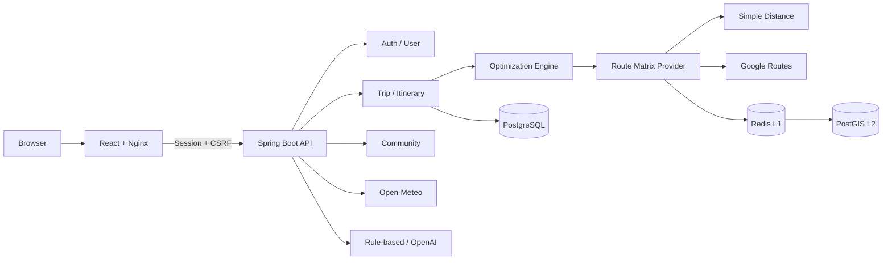

# RoutePlan

[](https://github.com/sungjuun/RoutePlan/actions/workflows/ci.yml)

RoutePlan은 여행 장소와 사용자 조건을 바탕으로 **실행 가능한 날짜별 일정과 이동 경로를 계산하는 여행 계획 플랫폼**입니다.

나라별 추천 루트 탐색부터 개인 일정 생성, 실제 지도·날씨·영업시간 연동, 예산 관리, 커뮤니티 공유와 여행 중 재최적화까지 하나의 흐름으로 제공합니다.

## 주요 기능

### 여행 계획과 최적화

- 1~14일 여행 생성과 날짜별 일정 관리
- 장소별 우선순위, 필수 방문, 체류시간, 선호 시간대, 영업시간 반영
- `Nearest Neighbor`, `Exact Search`, `Nearest Neighbor + 2-opt` 알고리즘 비교
- 날씨·예산·이동수단·현지 시간·숙소 복귀 조건을 반영한 일정 생성
- 완료한 일정은 보존하고 현재 위치·시각부터 남은 일정만 재최적화
- 시간대별 교통량을 고려한 다일 전역 탐색과 안전 상한 초과 시 기본 방식으로 전환

### 실제 데이터 연동

- Google Places 기반 장소 검색과 멱등 가져오기
- Google Routes 기반 도보·자동차·대중교통 Matrix
- Google Maps 실제 도로 Geometry 표시
- Open-Meteo 날씨 자동 조회와 주기적 갱신
- 장소 영업시간과 여행지 IANA 시간대 반영
- 규칙 기반 또는 OpenAI Structured Output 기반 자연어 여행 조건 해석

외부 Provider를 설정하지 않아도 좌표 직접 등록, 단순 거리 계산, 규칙 기반 자연어 해석으로 기본 흐름을 실행할 수 있습니다.

### 사용자와 커뮤니티

- 세션 기반 회원가입·로그인·로그아웃과 CSRF 보호
- 이메일 인증, 비밀번호 재설정·변경, 로그인 시도 제한
- 프로필 이미지·닉네임·이메일 변경과 회원 탈퇴
- 내가 만든 여행과 가져온 여행 목록
- 완성된 일정을 변경 불가능한 공개 Route Snapshot으로 공유
- 공개 Route 검색·정렬·좋아요·댓글·후기·신고·복사
- 복사한 Route를 내 숙소·날짜·취향으로 다시 최적화
- 날짜별·항목별 예산과 실제 지출 기록

### 캐시와 운영 안정성

- Redis L1 + PostGIS L2 경로 캐시
- 동일 캐시 미스의 중복 Google 호출을 줄이는 분산 갱신 잠금
- 외부 API Retry, Circuit Breaker, 동시 호출 제한과 장애 fallback
- Google·OpenAI 호출량, 지연시간, 실패율, 토큰과 선택적 예상 비용 집계
- Correlation ID, Actuator, Prometheus, Grafana, Alertmanager
- 운영용 HTTPS Reverse Proxy, 다중 Backend, 백업·복구·롤백 스크립트

## 사용자 흐름

```text
추천 국가·공개 Route 탐색
→ 회원가입 또는 로그인
→ 새 여행 생성
→ 장소 검색 또는 좌표 등록
→ 시간·우선순위·날씨·예산 조건 설정
→ 일정 최적화
→ 날짜별 타임라인과 지도 확인
→ 여행 중 남은 일정 재최적화
→ 일정 공개 또는 다른 사용자의 Route 복사
```

## 기술 스택

| 영역 | 기술 |
|---|---|
| Backend | Java 21, Spring Boot 4.1, Spring Security, Spring Data JPA |
| Database | PostgreSQL 16, PostGIS 3.5, Flyway |
| Cache | Redis 7.4, PostGIS 영속 경로 캐시 |
| Frontend | React 19, TypeScript 6, Vite 8, React Leaflet |
| Test | JUnit 5, Testcontainers, Vitest, Testing Library, Playwright |
| Operations | Docker Compose, Nginx, Caddy, Prometheus, Grafana, Alertmanager |
| External | Google Places·Routes·Maps, Open-Meteo, OpenAI Responses API |

## 아키텍처

기능 중심 모듈러 모놀리스로 구성되어 있습니다. 경로 순서 탐색과 현실 제약 일정 계산을 분리하고, 두 계산 계층이 같은 요청 단위 Route Matrix를 사용합니다.



주요 Backend 패키지는 다음과 같습니다.

```text
com.routeplan
├─ auth            인증·세션·CSRF·소유권 검사
├─ user            계정·프로필·비밀번호
├─ trip            여행과 선택 장소
├─ place           장소·영업시간·외부 검색
├─ optimization    경로 탐색과 제약 일정 계산
├─ itinerary       최적화 실행·버전·재최적화
├─ community       공개 Route·댓글·후기·신고
├─ weather         예보와 장소 환경 적합도
├─ budget          예상 비용·예산·실제 지출
├─ ai              자연어 조건 해석
└─ common          오류 응답·관측성·외부 Provider 운영
```

## 빠른 실행

### 준비물

- Docker Desktop 또는 Docker Engine + Compose
- Git

애플리케이션을 직접 실행하거나 테스트하려면 Java 21과 Node.js 22도 필요합니다.

### Docker Compose 실행

```powershell
git clone https://github.com/sungjuun/RoutePlan.git
cd RoutePlan
Copy-Item .env.example .env
docker compose up -d --build
```

macOS 또는 Linux에서는 환경 파일을 다음과 같이 복사합니다.

```bash
cp .env.example .env
docker compose up -d --build
```

기본 접속 주소:

| 서비스 | 주소 |
|---|---|
| Frontend | http://localhost:3100 |
| Backend | http://localhost:8180 |
| Swagger UI | http://localhost:8180/swagger-ui.html |
| 개발 메일함 | http://localhost:8026 |
| PostgreSQL | localhost:5432 |
| Redis | localhost:6379 |

이미 사용 중인 포트가 있다면 `.env`의 `FRONTEND_PORT`, `BACKEND_PORT`, `POSTGRES_PORT`, `REDIS_PORT`, `MAILPIT_PORT`를 변경합니다.

상태 확인과 종료:

```powershell
docker compose ps
docker compose logs -f backend frontend
docker compose down
```

`docker compose down`은 기본 PostgreSQL Volume을 삭제하지 않습니다.

### Backend와 Frontend 직접 실행

PostgreSQL과 Redis를 먼저 실행합니다.

```powershell
docker compose up -d postgres redis mailpit
```

Backend:

```powershell
.\gradlew.bat bootRun
```

Frontend는 별도 터미널에서 실행합니다.

```powershell
cd frontend
npm ci
npm run dev
```

Vite 개발 서버는 `http://localhost:5173`에서 열립니다. Backend를 Docker의 `8180` 포트로 실행한다면 다음과 같이 Proxy 대상을 지정합니다.

```powershell
$env:VITE_PROXY_TARGET = "http://localhost:8180"
npm run dev
```

## 외부 Provider 설정

기본 `.env.example`은 과금 없이 실행할 수 있도록 외부 장소 검색과 실제 경로 Provider가 비활성화되어 있습니다.

| 기능 | 주요 설정 | 기본값 |
|---|---|---|
| 장소 검색 | `ROUTEPLAN_PLACE_PROVIDER`, `GOOGLE_MAPS_API_KEY` | `DISABLED` |
| 실제 경로 Matrix | `ROUTEPLAN_ROUTE_PROVIDER`, `GOOGLE_MAPS_API_KEY` | `SIMPLE` |
| 브라우저 Google 지도 | `GOOGLE_MAPS_BROWSER_KEY` | 미설정 |
| 자연어 AI | `ROUTEPLAN_AI_PROVIDER`, `OPENAI_API_KEY` | `RULE_BASED` |
| Redis·PostGIS 경로 캐시 | `ROUTEPLAN_ROUTE_CACHE_ENABLED`, `ROUTEPLAN_ROUTE_DB_CACHE_ENABLED` | `false` |
| 시간대별 전역 최적화 | `ROUTEPLAN_TIME_DEPENDENT_GLOBAL_ENABLED` | `false` |

설정 예시는 다음 파일에 나뉘어 있습니다.

- `.env.example`: 기본 로컬 실행
- `.env.advanced.example`: Google·OpenAI·경로 캐시
- `.env.auth.example`: SMTP와 계정 보안
- `.env.operations.example`: 공급자 한도·비용·관측성
- `.env.production.example`: 운영 배포

API 키는 커밋하지 마세요. Google 서버 키와 브라우저 키는 분리하고, 브라우저 키에는 허용 도메인과 Maps JavaScript API 제한을 적용해야 합니다. 자세한 설정은 [실제 데이터·개인화·장부 안내](docs/advanced-integrations.md)를 참고하세요.

## 전 세계 샘플 데이터

목록·검색·지도·개인화·복사 흐름을 확인할 수 있도록 실제 장소 좌표를 기반으로 한 40개 공개 추천 Route를 제공합니다.

Compose 실행 후 PowerShell에서 다음 명령을 실행합니다.

```powershell
.\scripts\seed-global-samples.ps1
```

Git Bash 또는 Linux:

```bash
bash ./scripts/seed-global-samples.sh
```

스크립트는 기존 일반 사용자 데이터를 삭제하지 않으며 같은 샘플 버전을 다시 실행해도 중복을 만들지 않습니다. 데이터 출처와 검증 범위는 [전 세계 샘플 데이터 안내](docs/global-sample-data.md)를 확인하세요.

## 테스트

Backend 테스트는 PostgreSQL·PostGIS Testcontainers를 사용하므로 Docker가 실행 중이어야 합니다.

```powershell
.\gradlew.bat test
```

Frontend 단위 테스트·Lint·빌드:

```powershell
cd frontend
npm ci
npm test
npm run lint
npm run build
```

격리된 Docker 환경의 브라우저 E2E:

```powershell
cd frontend
npx playwright install chromium
npm run test:e2e:docker
npm run test:e2e:v25
```

알고리즘과 캐시는 일반 테스트와 분리된 Benchmark로 확인합니다.

```powershell
.\gradlew.bat algorithmBenchmark
.\gradlew.bat routeCacheBenchmark
.\gradlew.bat timeDependentBenchmark
```

GitHub Actions는 Backend, Frontend, 운영 설정 검사, 기존 브라우저 E2E와 V25 교통량·계층 캐시 E2E를 실행합니다.

## 프로젝트 구조

```text
RoutePlan/
├─ src/                         Spring Boot Backend
├─ frontend/                    React Frontend와 Playwright E2E
├─ docs/                        기능·운영 상세 문서
├─ deploy/                      Caddy·Nginx·Prometheus·Grafana·Alertmanager
├─ scripts/                     배포·백업·복구·검증·샘플 데이터
├─ tests/                       운영 검증 지원 파일
├─ compose.yaml                 로컬 개발 환경
├─ compose.e2e-v25.yaml         V25 격리 E2E 환경
├─ compose.production.yaml      운영 환경
└─ compose.operations.yaml      운영 장애·부하 검증 환경
```

## 상세 문서

| 문서 | 내용 |
|---|---|
| [실제 데이터·개인화·장부](docs/advanced-integrations.md) | Google·OpenAI·날씨·영업시간·예산·개인화·커뮤니티 설정 |
| [일정 정확도·프로필](docs/schedule-accuracy-profile.md) | 대중교통 재검증, 예보 갱신, 프로필 이미지와 알림함 |
| [계정 보안](docs/account-security.md) | 이메일 인증, 비밀번호 복구, 세션과 SMTP |
| [계정 관리](docs/account-management.md) | 프로필·이메일 변경과 회원 탈퇴 |
| [공급자 운영](docs/provider-operations.md) | Google·OpenAI 사용량, 비용, Circuit Breaker와 경고 |
| [시간대별 경로](docs/time-dependent-routing.md) | 교통량 전역 탐색, Redis L1과 PostGIS L2 |
| [실제 API 검증 기록](docs/live-validation-2026-08-28.md) | Google 실제 응답과 캐시 검증 범위 |
| [스테이징 배포](docs/staging-deployment.md) | 실제 배포 전 스테이징 준비와 검증 |
| [운영 배포](docs/production-deployment.md) | HTTPS, GHCR 이미지, 백업·복구·롤백 |
| [운영 모니터링](docs/production-monitoring.md) | Prometheus, Grafana, Alertmanager |
| [운영 검증](docs/operational-validation.md) | 부하·장애 주입과 다중 인스턴스 검증 |
| [전 세계 샘플 데이터](docs/global-sample-data.md) | 40개 공개 추천 Route와 출처·적재 방법 |

API 계약은 실행 중인 [Swagger UI](http://localhost:8180/swagger-ui.html)에서 확인할 수 있습니다.

## 개발 단계 요약

| 단계 | 핵심 결과 |
|---|---|
| V1~V6 | 기본 경로 알고리즘, 제약 일정, 실제 Route Matrix, Redis 캐시, 잔여 일정 재최적화 |
| V7~V12 | 공개 Route, 자연어 조건, 다일 일정, 관측성, 외부 Provider Retry |
| V13~V20 | 인증·인가, 공개 메인과 개인 여행, 브라우저 E2E, 날씨·예산, 계정 보안·관리 |
| V21~V22 | 외부 API 품질·비용 대시보드, Circuit Breaker, 동시 호출 격리, 분산 잠금 |
| V23~V24 | 운영 배포, 백업·복구·롤백, 다중 Backend, 모니터링과 알림 |
| V25 | 시간대별 교통량 전역 최적화, PostGIS 영속 캐시, 부하·장애·동시 요청 E2E |

## 현재 제한사항

- 기본 `SIMPLE` 경로는 직선거리와 평균속도 기반 추정치입니다. 실제 도로·대중교통은 Google Provider 설정이 필요합니다.
- Google·OpenAI의 실제 호출량과 비용은 프로젝트 설정 및 공급자 과금 정책에 따라 달라집니다.
- `Exact Search`는 조합 폭증을 막기 위해 최대 10개 장소로 제한됩니다.
- 시간대별 전역 최적화는 후보·날짜·Matrix·상태·실행시간 안전 상한을 넘으면 기본 방식으로 전환됩니다.
- 날씨 예보 범위 밖의 먼 미래 날짜와 제공되지 않은 공휴일 예외는 자동 확정하지 않습니다.
- 예산과 실제 지출은 사용자가 입력하며 실시간 환율·결제·인원별 정산은 지원하지 않습니다.
- OAuth와 MFA, 다중 턴 AI 대화, AI의 장소 자동 추가는 아직 지원하지 않습니다.
- 운영 모니터링은 단일 서버 기준이며 외부 Uptime 감시, 중앙 로그, 장기 원격 보존은 별도 구성이 필요합니다.

## 보안 주의사항

- `.env`와 API 키, SMTP 비밀번호, 운영 인증정보를 Git에 커밋하지 마세요.
- 운영에서는 `ROUTEPLAN_SESSION_COOKIE_SECURE=true`와 HTTPS를 사용해야 합니다.
- 배포 전 [운영 설정 검사](scripts/check-production-config.sh)와 관련 배포 문서를 확인하세요.
